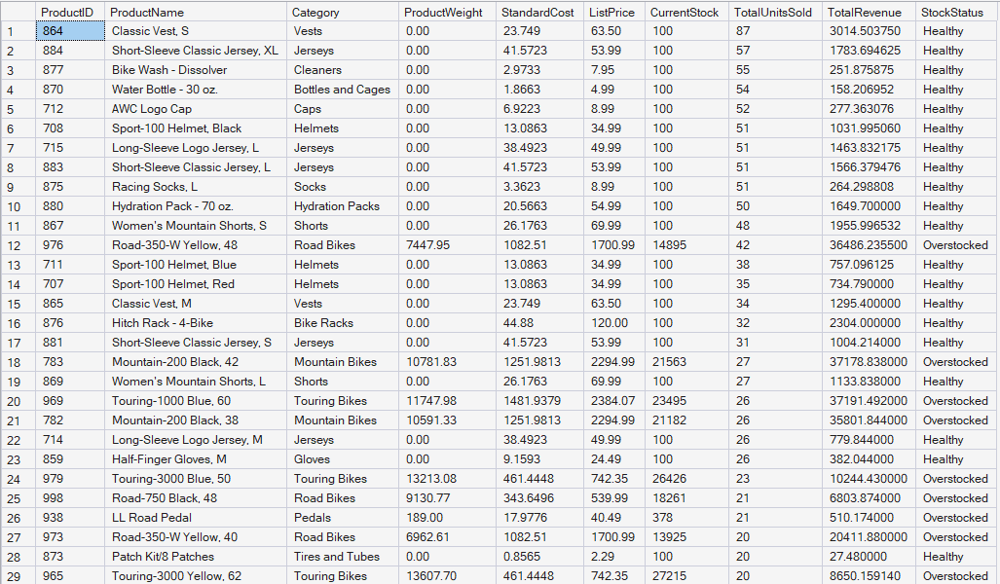

# Supply Chain Risk & Dead Stock Diagnostic

## Executive Summary
This project delivers a real-time inventory diagnostic model designed to identify capital allocation inefficiencies. By isolating slow-moving inventory (dead stock) and flagging critical stock-out risks, the dashboard provides procurement and supply chain managers with direct, SKU-level action matrices to optimize working capital.

## Architecture & Technical Execution

### 1. Raw Data Extraction
Initial extraction from the `AdventureWorksLT` database displaying the unstructured state of the relational tables prior to analytical transformation.


### 2. Data Transformation & Cleaning (SQL Server)
Engineered a customized view (`vw_InventoryAnalysis`) extracting from the `AdventureWorksLT` database to structure the data for real-time diagnostic reporting. 



- Integrated `SalesLT.Product` and `SalesLT.ProductCategory`.
- Engineered simulated real-time variance for `OnHandQty` utilizing modulo operators to bypass static historical limitations.
- Established dynamic `SafetyStockLevel` thresholds to drive conditional formatting parameters.

```sql
-- Core View Definition Segment
CREATE OR ALTER VIEW vw_InventoryAnalysis AS
SELECT 
    p.ProductID, p.Name AS ProductName, pc.Name AS CategoryName, p.StandardCost, p.ListPrice,
    CAST(((p.ProductID % 50) + 5) AS INT) AS OnHandQty, 
    CAST(((p.ProductID % 30) + 15) AS INT) AS SafetyStockLevel
FROM SalesLT.Product p
LEFT JOIN SalesLT.ProductCategory pc ON p.ProductCategoryID = pc.ProductCategoryID;
