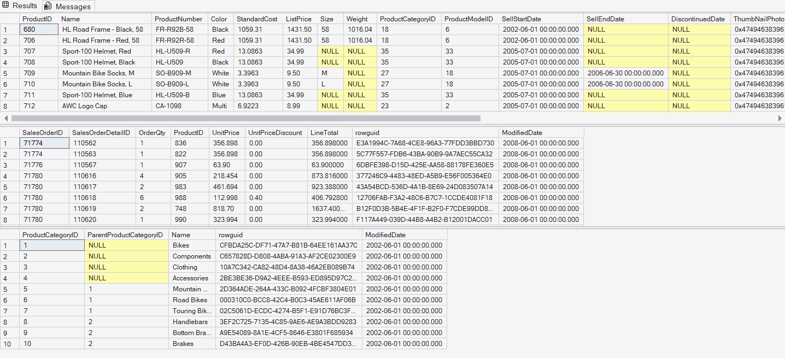
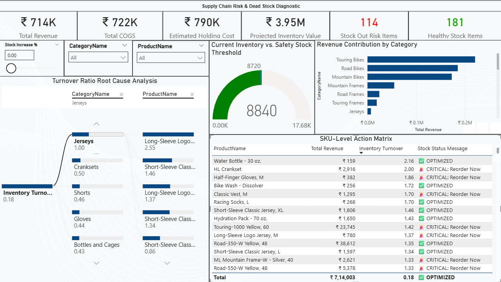

# Supply Chain Risk & Dead Stock Diagnostic  
**Platform:** SQL Server + Power BI  
**Database:** :contentReference[oaicite:0]{index=0}  
**Visualization Tool:** :contentReference[oaicite:1]{index=1}  

---

## Executive Overview

This project delivers a prescriptive inventory diagnostic system engineered to:

- Identify **dead stock** (working capital drain)
- Detect **critical stock-out risks** (revenue exposure)
- Enable **SKU-level procurement decisions**
- Simulate capital impact via scenario modeling

The model transforms a static sample database into a controlled simulation environment that forces supply chain action.

---

# 1. Data Engineering Layer (SQL Server)

## Raw Database Context

The base `AdventureWorksLT` schema contains product and sales data but lacks dynamic inventory volatility.  
To simulate live operational risk, controlled mathematical variance was introduced.



---

## Inventory Simulation View

A custom SQL view was created to artificially generate inventory movement and safety threshold breaches.

### File:
`01_vw_InventoryAnalysis.sql`

### Logic:
- Uses modulo (`%`) operator on `ProductID`
- Forces structured variance in:
  - `OnHandQty`
  - `SafetyStockLevel`
- Creates deterministic but dynamic inventory risk conditions

### SQL Script

```sql
CREATE OR ALTER VIEW vw_InventoryAnalysis AS
SELECT 
    p.ProductID,
    p.Name AS ProductName,
    pc.Name AS CategoryName,
    p.StandardCost,
    p.ListPrice,
    CAST(((p.ProductID % 50) + 5) AS INT) AS OnHandQty, 
    CAST(((p.ProductID % 30) + 15) AS INT) AS SafetyStockLevel
FROM SalesLT.Product p
LEFT JOIN SalesLT.ProductCategory pc 
    ON p.ProductCategoryID = pc.ProductCategoryID;


```
# Power BI: Supply Chain Risk & Inventory Diagnostic Dashboard

## Executive Summary
A prescriptive visual diagnostic model engineered in Power BI to isolate dead stock, forecast stock-outs, and simulate capital allocation requirements via dynamic parameters.

## Dashboard Execution Interface


## Technical Implementation

### Relational Data Modeling
- Deployed a Star Schema architecture connecting historical transaction fact tables (`SalesOrderDetail`) with the custom diagnostic inventory dimension.
- Enforced unidirectional, one-to-many filtering to eliminate data ambiguity and cross-filtering errors.
- Isolated current-state physical stock metrics from historical time-intelligence dimensions.

### DAX Measure Engineering
- **Inventory Turnover Ratio:** Engineered using iterator functions (`SUMX`) for row-level valuation and `DIVIDE` to suppress baseline mathematical errors.
- **Conditional Risk Logic:** Programmed conditional strings (`🚨 CRITICAL: Reorder Now` / `✅ OPTIMIZED`), overriding native GUI limitations to establish strict visual hierarchy in matrices.
- **Financial Baselines:** Calculated aggregate metrics for Total Revenue, Total COGS, and Inventory Value.

### Scenario Parameter Simulation (What-If Analysis)
- Integrated a disconnected numeric range parameter (`Stock Increase %`).
- Injected parameter variables directly into DAX calculations to simulate the capital impact of inflating safety stock thresholds on `Projected Inventory Value` and standard 20% `Estimated Holding Cost`.

### UI/UX & Visual Interface Design
- **Root Cause Isolation:** Deployed a Decomposition Tree to break down aggregate turnover ratios by Category and Product, isolating lagging assets.
- **Exposure Assessment:** Positioned a high-density KPI band at the top of the Z-pattern visual hierarchy for immediate financial liability identification.
- **Actionable Output:** Configured a granular, conditionally formatted SKU-Level Action Matrix sorted by turnover velocity for direct procurement execution.
- **Cognitive Load Reduction:** Stripped all default visual borders and enforced negative space formatting (#FFFFFF backgrounds on #F3F2F1 canvas) to maximize the data-to-ink ratio.
